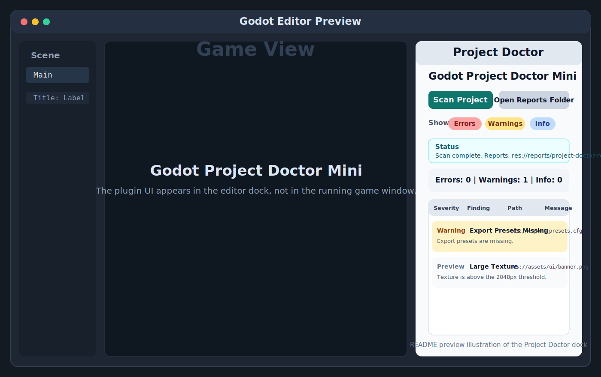

# Godot Project Doctor Mini

[](https://github.com/Vav-Labs/godot-project-doctor-mini/actions/workflows/smoke-test.yml)
[](https://godotengine.org/)
[](LICENSE)
[](#roadmap)

Godot Project Doctor Mini is a small Godot 4 editor plugin that scans a project and generates simple Markdown and JSON diagnostic reports.

It helps catch common project hygiene issues such as missing scripts, broken resource paths, oversized textures, heavy scenes, empty folders, and missing export presets.

## Status

This project is an early MVP. It is usable for local project checks, but the scanner is intentionally conservative and should not be treated as a full dependency graph analyzer yet.

## Features

- Godot editor dock named `Project Doctor`
- One-click project scan
- Markdown and JSON report output
- Headless scan script for local automation or CI
- Severity summary for errors, warnings, and info findings
- Severity filters in the editor dock
- Button to open the generated reports folder

## Preview



Current preview asset showing the dock layout and primary controls.

## Checks

| Check | Severity | Purpose |
| --- | --- | --- |
| Missing scripts | Error | Finds scene/resource references to scripts that no longer exist. |
| Broken resource paths | Error | Finds referenced `res://` paths that cannot be found. |
| Large textures | Warning | Flags textures above the current size threshold. |
| Scenes with many nodes | Warning | Highlights scenes that may need review or splitting. |
| Scripts using `_process()` | Info | Marks scripts with per-frame work for manual review. |
| Empty folders | Info | Helps keep the project tree tidy. |
| Possibly unused files | Info | Finds files not referenced by scanned text resources. |
| Missing export presets | Warning | Reminds you to create export presets before release builds. |

## Requirements

- Godot 4.6 or newer

The plugin is written in GDScript and runs inside the Godot editor.

## Installation

To use the plugin in another Godot project:

1. Copy `addons/project_doctor_mini/` into the target project's `addons/` folder.
2. Open the project in Godot.
3. Go to `Project > Project Settings > Plugins`.
4. Enable `Godot Project Doctor Mini`.
5. Open the `Project Doctor` dock in the editor.

To try it in this repository, open this project in Godot and enable the plugin from the same Plugins screen.

## Usage

The Project Doctor UI appears inside the Godot editor. It does not appear in the running game window.

1. Open the `Project Doctor` dock.
2. Click `Scan Project`.
3. Review the summary and findings list.
4. Use the severity filters if needed.
5. Open the generated reports from `reports/`.

Each scan writes:

- `reports/project-doctor-report.md`
- `reports/project-doctor-report.json`

## Headless Scan

You can run the scanner without opening the editor dock:

```text
godot --headless --path . --script res://addons/project_doctor_mini/tools/run_project_scan.gd
```

The smoke test validates the report schema and confirms that the report writers can create files:

```text
godot --headless --path . --script res://addons/project_doctor_mini/tools/run_project_doctor_smoke_test.gd
```

## Report Format

The JSON report uses this top-level shape:

```json
{
  "tool": "Godot Project Doctor Mini",
  "tool_version": "0.1.0",
  "generated_at": "2026-05-13T00:00:00",
  "project_root": "res://",
  "scan_duration_ms": 18,
  "summary": {
    "errors": 0,
    "warnings": 1,
    "info": 0
  },
  "findings": []
}
```

Each finding includes:

```json
{
  "id": "export_presets_missing",
  "severity": "warning",
  "title": "Export Presets Missing",
  "path": "res://export_presets.cfg",
  "message": "Export presets are missing.",
  "recommendation": "Create export presets before release builds."
}
```

## Project Structure

```text
addons/project_doctor_mini/
  plugin.cfg
  project_doctor_plugin.gd
  project_doctor_dock.gd
  scanner/project_scanner.gd
  report/markdown_report_writer.gd
  report/json_report_writer.gd
  tools/run_project_scan.gd
  tools/run_project_doctor_smoke_test.gd
```

## Development

Useful local checks:

```text
godot --headless --path . --quit
godot --headless --path . --script res://addons/project_doctor_mini/tools/run_project_scan.gd
godot --headless --path . --script res://addons/project_doctor_mini/tools/run_project_doctor_smoke_test.gd
```

See [docs/TESTING.md](docs/TESTING.md) for the manual and headless testing flow.

## Documentation

- [Project concept](docs/GODOT_PROJECT_DOCTOR_MINI.md)
- [Implementation plan](docs/GODOT_PROJECT_DOCTOR_MINI_IMPLEMENTATION_PLAN.md)
- [Testing guide](docs/TESTING.md)
- [Public release checklist](docs/PUBLIC_RELEASE_CHECKLIST.md)
- [Changelog](CHANGELOG.md)
- [Contributing](CONTRIBUTING.md)

## Known Limitations

- Dynamic resource loads may not always be detected.
- `Possibly unused file` findings must be manually reviewed before deleting files.
- The current scanner uses simple text/resource checks, not a full Godot dependency graph.
- Thresholds are currently hardcoded defaults.
- The plugin is editor-only and does not appear in the running game window.

## Roadmap

- Plugin settings for thresholds and ignore patterns
- Baseline file for accepted findings
- More conservative unused-file detection
- Export profile readiness checks per platform
- Import settings analysis
- Scene dependency graph
- GitHub Action for headless scan on pull requests
- Asset Library packaging checklist

## Contributing

Issues and small pull requests are welcome.

Good first contribution areas:

- Add a new scanner check.
- Improve false-positive handling.
- Add a sample project for testing.
- Improve report formatting.
- Add screenshots or short usage examples.

Please keep changes small and focused while the project is still in MVP shape.

## License

MIT License. See [LICENSE](LICENSE).
